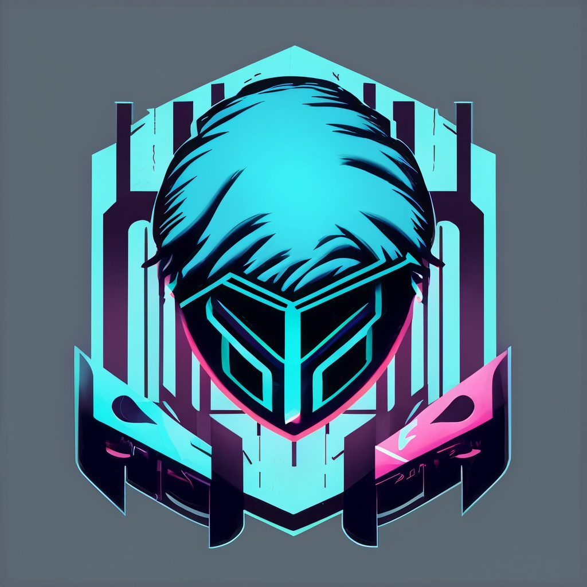

# Seregon

Hello, I'm Seregon! 👋
You can use the pronouns he/him when referring to me.

I am the founder of Maudrigal, an IT student, and I'm about to enroll at La Sapienza computer science faculty in Rome.

## About Me

- 🔭 Currently working on various programming projects.
- 🌱 Learning and exploring new technologies in the field of computer science.
- 👯 Looking to collaborate on open-source projects.
- 💬 Feel free to ask me anything related to programming or technology.
- 📫 How to reach me: [seregonwar@gmail.com](mailto:seregonwar@gmail.com)
- 😄 Fun fact: I enjoy playing the guitar in my free time.

## Skills

- Programming languages: Python, Java, C++
- Web development: HTML, CSS, JavaScript
- Version control: Git
- Operating systems: Windows, Linux

## Projects

- **Maudrigal**: A platform for creative minds to connect and share their artistic works. [maudrigal.com](https://www.maudrigal.com)
- **Portfolio Website**: My personal portfolio website showcasing my projects and skills. [seregon.com](https://www.seregon.com)

Feel free to reach out to me if you have any questions or if you'd like to collaborate on a project!

Let's connect and build something amazing together! 🚀
